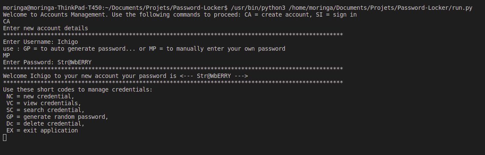

# password-locker

#### By Dorothy Muhonja
## Description
A python project that manages user login and signup credentials for various accounts. it also stores user passwords

## Project Set-Up Instructions
* Click this [link](https://github.com/dorothymuhonja/password-locker.git) to access my repository
* Clone the project to your local machine
* Run the project folder in your preferred editor

### Behaviour Driven Development
#### For Sign up
* Run run.py command on the terminal
* Select CA to sign up
* Enter your username
* Select MP to manually input your password or use  GP to get an autogenerated password

#### For login
* Enter SI to sign in
* Enter your username
* Enter your password

#### Other Options
 * NC = new credential, 
 * VC = view credentials, 
 * SC = search credential, 
 * GP = generate random password, 
 * Dc = delete credential, 
 * EX = exit application

 ### Known Bugs
 GP(Generate random password) returns an error

## Technologies Used
* python3

### Screenshots

### Email Address
dorothymuhonja7@gmail.com

### License and Copyright

Copyright (c) 2021 Dorothy Muhonja

[MIT License](LICENSE)